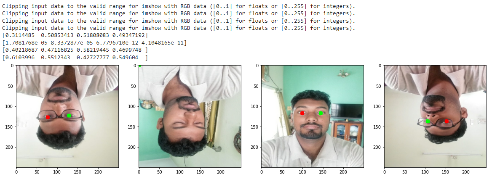

# Iris-detection

## Overview
In this notebook, you can learn how to implement object detection just using tensorflow, keras and opencv with a self-build model. 
For Labeling you can use keypoint detection in labelme library.

## Technology
Tensorflow, keras, Opencv, Labelme

## Prediction pic

